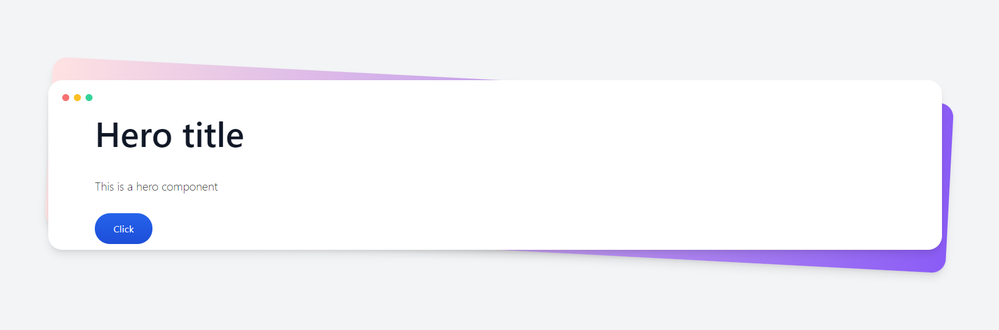

# Contentful + Vite + Vue 3



Demo: https://contentful-vite-vue.vercel.app/

## Getting started

Place your API keys on the `.env.local` file

```
VITE_SPACE=''
VITE_ACCESS_TOKEN=''
```

Install the dependencies

```sh
npm i
```

Run the solution

```sh
npm run dev
```
